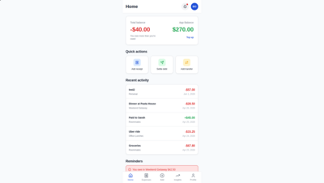
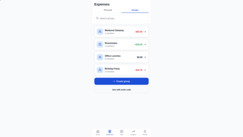
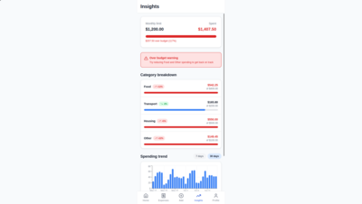
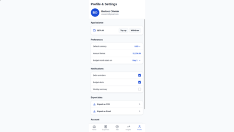
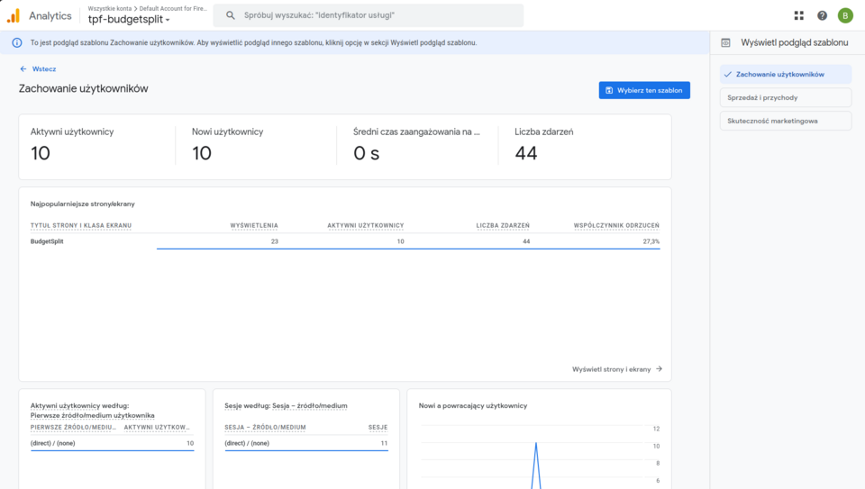
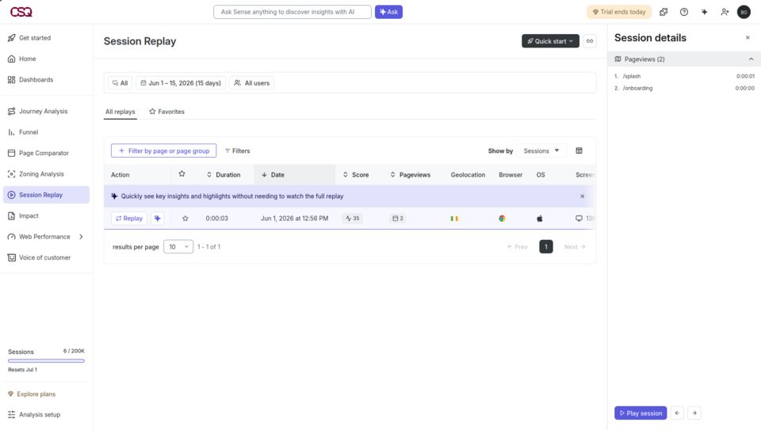

# BudgetSplit

Mobile-first web app for group expense splitting and personal budgeting.

**Live demo:** [https://tpf-budgetsplit.web.app](https://tpf-budgetsplit.web.app)

UI is based on the [BudgetSplit Figma wireframes](https://www.figma.com/design/DAeOlvEG2xOdkj7HoEg7Kb/BudgetSplit-mobile-wireframes).

## Screenshots

### Application

**Home**



**Expenses**



**Insights**



**Profile**



### Google Analytics 4

SPA pageviews are tracked on each React Router navigation. Production property: `G-1BP0LY9MX0`.



### Hotjar / Contentsquare

Session replay and behavior analytics on the deployed app (`https://tpf-budgetsplit.web.app`).



## Getting started

```bash
npm install
cp .env.example .env
# Fill in Firebase, Hotjar and GA4 values (see Configuration)
npm run dev
```

Open [http://localhost:5173](http://localhost:5173). The app starts at `/splash`.

## Scripts

| Command | Description |
|---------|-------------|
| `npm run dev` | Development server |
| `npm run build` | Production build (`dist/`) |
| `npm run preview` | Preview production build locally |
| `npm run start` | Serve `dist/` locally (optional) |
| `npm run deploy:firebase` | Build + deploy to Firebase Hosting |

## Configuration

Copy [`.env.example`](.env.example) to `.env` and set:

| Variable | Service |
|----------|---------|
| `VITE_FIREBASE_*` | [Firebase](https://console.firebase.google.com) — Web app + Email/Password + Google sign-in |
| `VITE_HOTJAR_SCRIPT_URL` | [Hotjar](https://www.hotjar.com) — Contentsquare script URL from **Install → Script** |
| `VITE_GA_MEASUREMENT_ID` | [Google Analytics 4](https://analytics.google.com) — `G-XXXXXXXXXX` |

Analytics scripts load only when the corresponding env vars are set, so local dev works without them.

## Deploy on Firebase Hosting

The app is a Vite SPA; Hosting serves the **`dist/`** folder after `npm run build` (see [`firebase.json`](firebase.json)).

**Live URL:** [https://tpf-budgetsplit.web.app](https://tpf-budgetsplit.web.app)

### Manual deploy

```bash
cp .env.example .env   # fill VITE_* values
npm run deploy:firebase
```

### CI deploy

On push to `main`, [`.github/workflows/firebase-hosting-merge.yml`](.github/workflows/firebase-hosting-merge.yml) builds and deploys to Firebase Hosting. PR previews use [`.github/workflows/firebase-hosting-pull-request.yml`](.github/workflows/firebase-hosting-pull-request.yml).

Repository secrets (`Settings → Secrets → Actions`): `FIREBASE_SERVICE_ACCOUNT_TPF_BUDGETSPLIT` and all `VITE_*` variables from `.env.example`.

### Firebase Auth domains

In Firebase Console → **Authentication** → **Settings** → **Authorized domains**:

- `localhost`
- `tpf-budgetsplit.web.app`
- `tpf-budgetsplit.firebaseapp.com`

## Project structure

```
src/
  app/          Application shell and routing
  pages/        Screen components
  components/   Shared UI, auth guards, tracking
  contexts/     Auth and app data providers
  services/     Domain logic and localStorage persistence
  lib/          Firebase, formatters, analytics
  styles/       Global styles and design tokens
  types/        TypeScript types
assets/
  screenshots/  Application and analytics screenshots
```