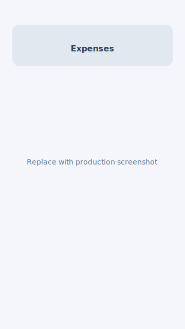
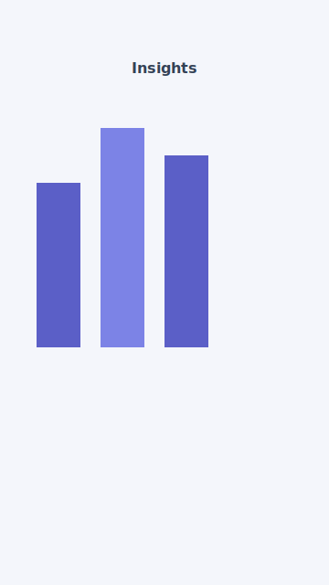
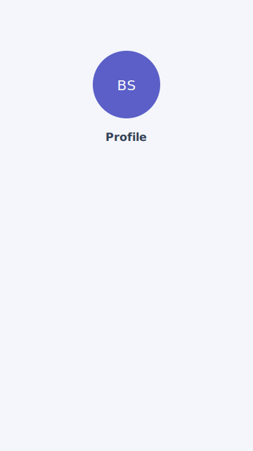

# BudgetSplit

Mobile-first web app for group expense splitting and personal budgeting.

**Live demo:** `https://YOUR-RAILWAY-APP.up.railway.app` — replace after [Railway deploy](#deploy-on-railway).

UI is based on the [BudgetSplit Figma wireframes](https://www.figma.com/design/DAeOlvEG2xOdkj7HoEg7Kb/BudgetSplit-mobile-wireframes).

## Getting started

```bash
npm install
cp .env.example .env
# Fill in Firebase, Hotjar and GA4 values (see Configuration)
npm run dev
```

Open [http://localhost:5173](http://localhost:5173). The app starts at `/splash`.

Component preview (development): `/dev/ui`.

## Scripts

| Command | Description |
|---------|-------------|
| `npm run dev` | Development server |
| `npm run build` | Production build (`dist/`) |
| `npm run preview` | Preview production build locally |
| `npm run start` | Serve `dist/` (used on Railway) |

## Configuration

Copy [`.env.example`](.env.example) to `.env` and set:

| Variable | Service |
|----------|---------|
| `VITE_FIREBASE_*` | [Firebase](https://console.firebase.google.com) — Web app + Email/Password (optional: Google sign-in) |
| `VITE_HOTJAR_SITE_ID` | [Hotjar](https://www.hotjar.com) — Site ID (numeric) |
| `VITE_GA_MEASUREMENT_ID` | [Google Analytics 4](https://analytics.google.com) — `G-XXXXXXXXXX` |

Analytics scripts load only when the corresponding env vars are set, so local dev works without them.

## Deploy on Railway

1. Push this repo to GitHub and create a project on [Railway](https://railway.com).
2. **New Project → Deploy from GitHub repo** and select this repository.
3. Railway uses [`railway.toml`](railway.toml): build runs `npm run build`, start runs `npm run start` (`serve -s dist` with SPA fallback).
4. In Railway **Variables**, add every `VITE_*` key from `.env.example` (Vite embeds them at **build** time — redeploy after changing vars).
5. Enable **Email/Password** (and Google if used) in Firebase Console; add your Railway domain under Firebase **Authorized domains**.
6. Copy the public URL into this README (`Live demo` above).

## Project structure

```
src/
  app/          Application shell and routing
  pages/        Screen components
  components/   Shared UI, auth guards, tracking
  contexts/     Auth and app data providers
  services/     Domain logic and localStorage persistence
  lib/          Firebase, formatters, constants
  styles/       Global styles and design tokens
  types/        TypeScript types
assets/
  screenshots/  README screenshots (replace placeholders after deploy)
```

## Screenshots

### Application

| Home | Expenses | Insights | Profile |
|------|----------|----------|---------|
|  |  |  |  |

### Google Analytics

After deploy, browse several routes while logged in, then capture GA4 **Realtime** or **Pages** reports:


Replace `assets/screenshots/ga-realtime.svg` with a PNG export from your GA4 property.

### Hotjar

Use the deployed app for a few minutes so Hotjar records a session, then screenshot **Recordings** or **Heatmaps**:


Replace `assets/screenshots/hotjar-dashboard.svg` with a PNG export from Hotjar.

## Verification checklist (before lab submission)

- [ ] Firebase sign-up, sign-in, sign-out and password reset work on the deployed URL
- [ ] Protected routes redirect guests to `/signin`
- [ ] Unknown paths show the 404 page
- [ ] GA4 receives pageviews when navigating between routes (SPA)
- [ ] Hotjar records at least one session on production
- [ ] README **Live demo** link points to Railway
- [ ] Screenshot files in `assets/screenshots/` updated with real captures (not placeholders)

## Team branches

| Branch | Author | Scope |
|--------|--------|-------|
| `bartosz` | Bartosz (voozen) | Firebase Authentication, 404 page |
| `monika` | Monika (monika756) | Hotjar + Google Analytics |
| `laura` | Laura (H4nkyP4nky) | Railway deploy + documentation |

Merge order into `main`: `bartosz` → `monika` → `laura`.
